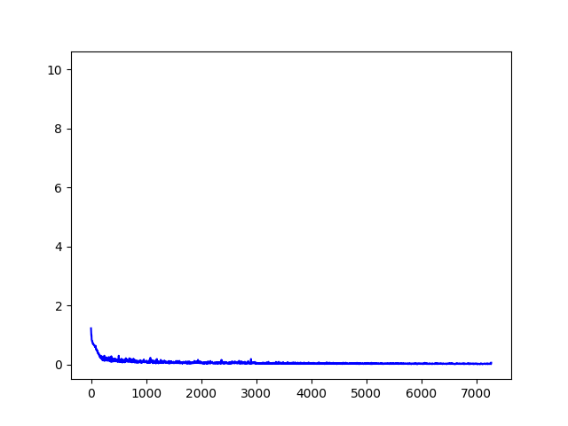
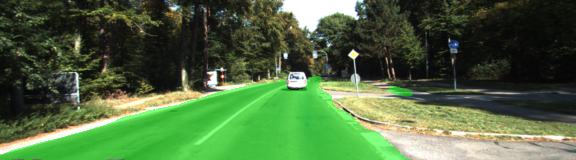
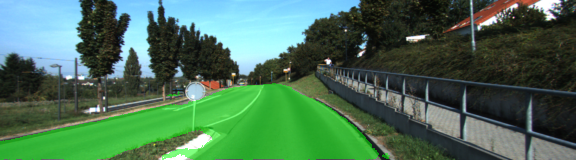
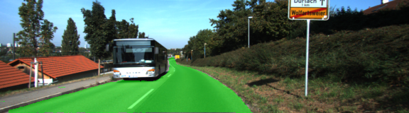

# Semantic Segmentation Project

---

Implementation of Semantic Segmentation using fully convolutional network as specified in [this](https://arxiv.org/pdf/1411.4038.pdf) paper.

Network architecture:

Key points:

- Used `truncated_normal_initializer` kernel initializers to initialize the weights.
- Used `l2_regularizer` for regularization.
- Use `AdamOptimizer`
- Tried different batch sizes and epochs. Used [this](https://stats.stackexchange.com/questions/164876/tradeoff-batch-size-vs-number-of-iterations-to-train-a-neural-network) article to decide on best parameters

Loss Curve:

Example Segmentation Results:

